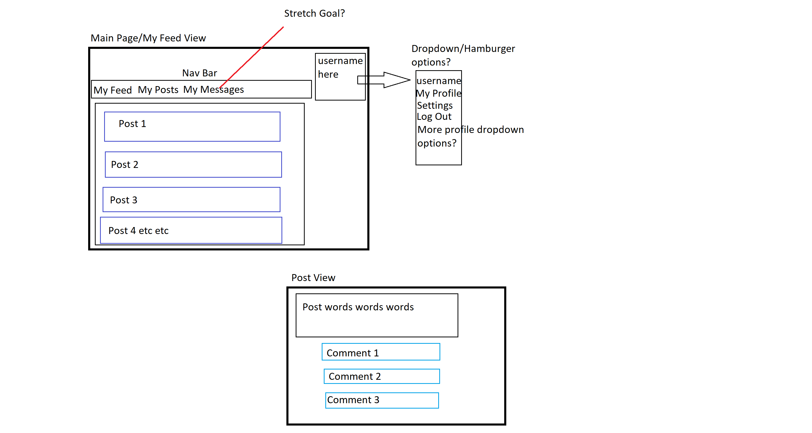
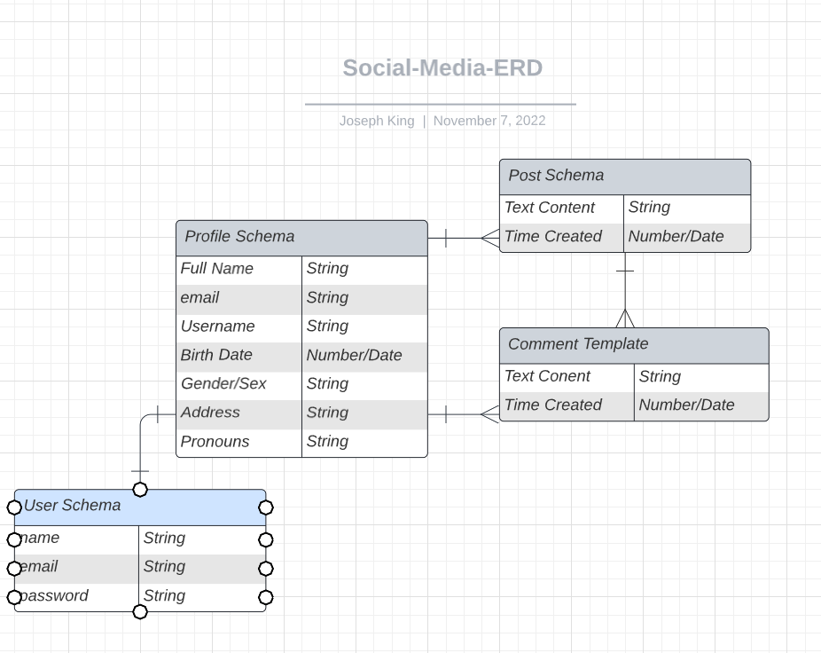

# The Network
Simplistic social media app demonstrating one-many relationships. Uses Google OAuth for verifying users.

# Screenshots
Wireframe

ERD

# Technologies Used

- JS
- EJS/HTML
- Express
- MongoDB
- Mongoose
- Google OAuth